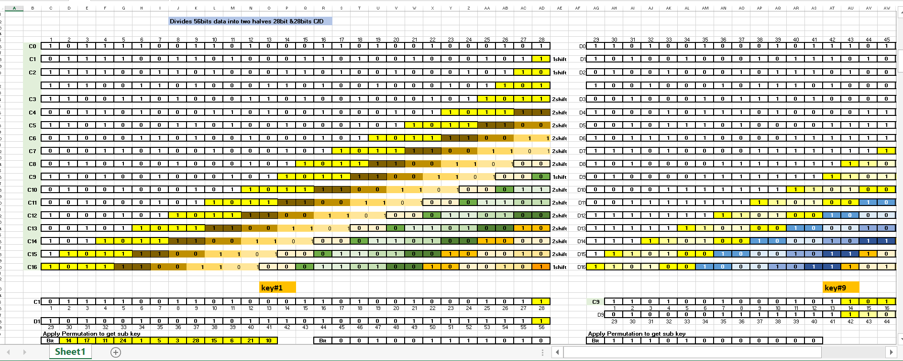
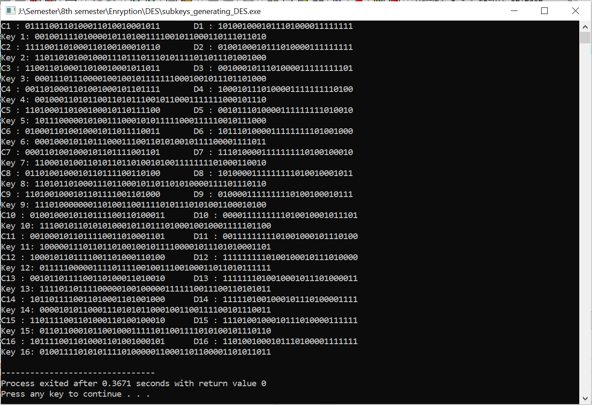
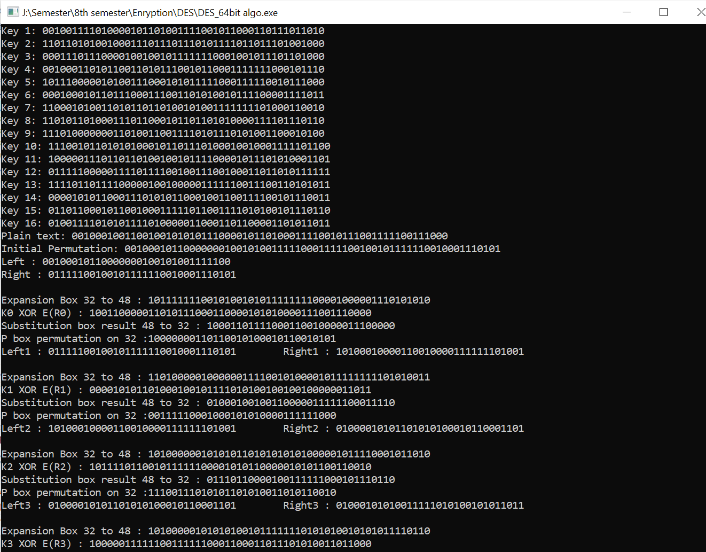
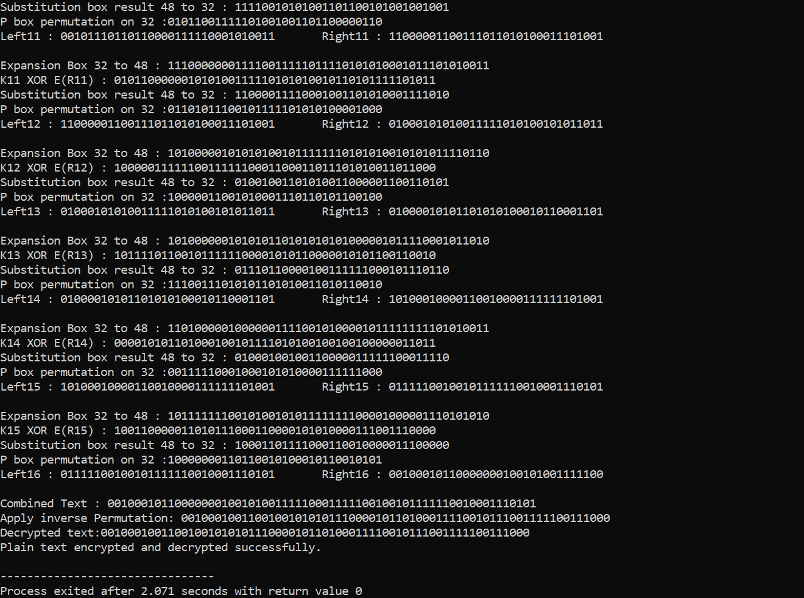

# DES-Algorithm
Data Encryption Standard(DES) base on Feistal Cipher Data encrypted in 64-bit blocks using a 56-bit key (effective key) Ciphertext is of 64-bit long Encrypts by series of substitution and transpositions (or permutations).

In binary block ciphers, diffusion can achieved by repeatedly performing some permutation on the data followed by applying a function to that permutation
Confusion can be achieved by the use of a complex substitution algorithm. A simple linear substitution algorithm adds little confusion.

Feistal Cipher provide confusion and diffusion of message.

# Above folder
### Source Code and Excel Sheet Avaliable with complete Explanation.

## DES Encryption and Decryption Explanation in Excel Sheet

## Subkeys Generatng: 16 keys
16 stages consisting of: 
selecting 24-bits from each half 
permuting them by PC2 for use in function f, 
rotating each half separately either 1 or 2 places depending on the key rotation schedule K
Now, let’s first learn how to generate 16 sub-keys for each round of DES, given a secret key K of 64 bits long (includes 8 parity bits) by the sender 
K= [0101 1000 0001 1111 1011 1100 1001 0100 1101 0011 1010 0100 0101 0010 1110 1010] 
For each byte,  the 8th bit is 1 if the number of 1s in the first 7 bits is even, 0 otherwise.

## DES Encryption and Decryption Rounds

## DES Encryption and Decryption Verification 

